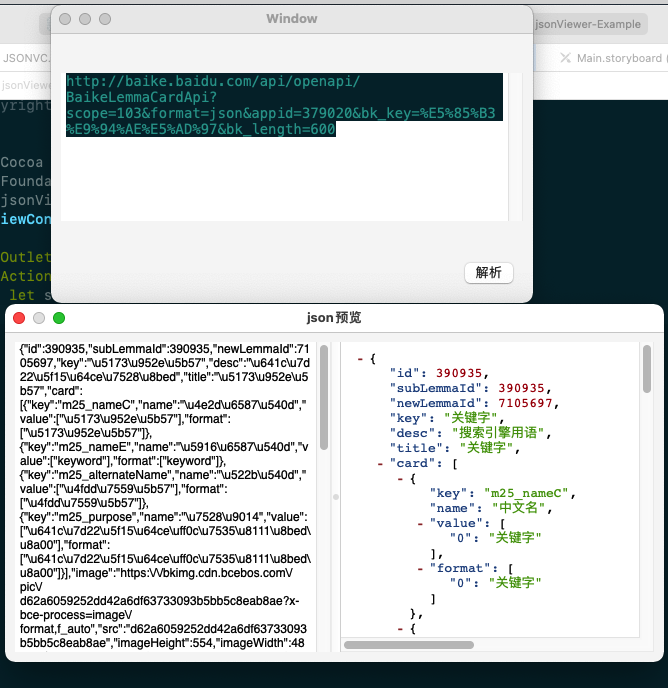

# jsonViewer

[](https://travis-ci.org/songxing10000/jsonViewer)
[](https://cocoapods.org/pods/jsonViewer)
[](https://cocoapods.org/pods/jsonViewer)
[](https://cocoapods.org/pods/jsonViewer)

## Example

To run the example project, clone the repo, and run `pod install` from the Example directory first.

## Requirements

## Installation

jsonViewer is available through [CocoaPods](https://cocoapods.org). To install
it, simply add the following line to your Podfile:

```ruby
pod 'jsonViewer'
```

## Author

songxing10000, songxing10000@live.cn

## License

jsonViewer is available under the MIT license. See the LICENSE file for more info.
